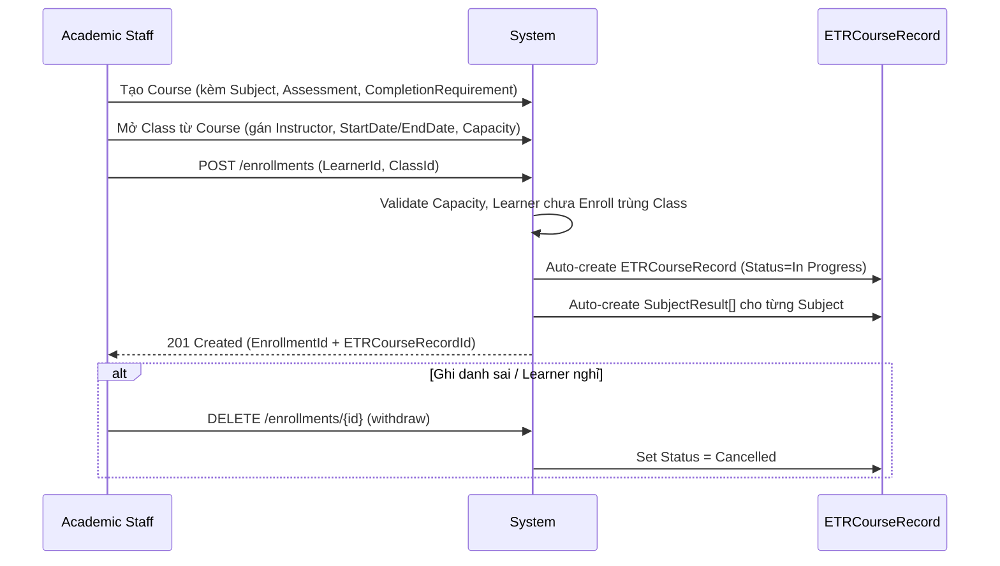

# 3. Manage Course, Class & Enrollment (Quản lý Khóa học, Lớp học & Ghi danh)

## 3.1 Mục đích & Phạm vi

Cầu nối giữa dữ liệu nền (Learner) và quá trình đào tạo thực tế. Đây là module chứa **điểm kích hoạt (trigger) quan trọng nhất của toàn hệ thống**: Enrollment thành công → tự động sinh ETRCourseRecord.

## 3.2 Actors & RBAC

| Actor | Quyền hạn |
|---|---|
| **Academic Staff / Training Manager** | Tạo/cập nhật Course, mở Class, gán Instructor (per-Subject via `InstructorAssignments[]`), Enroll/Withdraw Learner |
| **Instructor** | Read-only Course/Class thông tin cấu hình (không sửa "luật chơi"); cập nhật Session đã được tạo sẵn (ngày, phòng học, điểm danh) |

## 3.3 Ba thực thể cốt lõi — PHẢI phân biệt rõ

| Entity | Vai trò | Đặc điểm |
|---|---|---|
| **Course** | "Bản thiết kế gốc" — trừu tượng, chưa có người học | Gồm Subject, Assessment, CompletionRequirement. Có `ValidityMonths` (hạn hiệu lực chứng chỉ sau khi hoàn thành) |
| **Class** | "Thực thể sống" sinh ra từ 1 Course | Có `StartDate/EndDate`, `Location`, `Capacity`, `Status`. Instructor được phân công **per-Subject** qua bảng `ClassSubject` (xem addition-3.md) — Class không còn `InstructorAccountId` trực tiếp |
| **CourseEnrollment** | "Sợi dây sinh mệnh" nối Learner ↔ Class | `Status` (Active/Failed/Withdrawn/Completed), sinh ra đúng 1 `ETRCourseRecord` |

## 3.4 Business Rules

1. Course phải có ≥ 1 Subject trước khi được dùng để mở Class (đã enforce trong code: tạo Course yêu cầu tối thiểu 1 subject).
2. Class không thể có sĩ số vượt `Capacity`.
3. **Enroll thành công → hệ thống AUTO tạo `ETRCourseRecord` (Status = `In Progress`) và các `SubjectResult` con tương ứng với từng Subject của Course** — đây là business rule quan trọng nhất của toàn hệ thống, không được bỏ sót khi refactor.
4. Withdraw/Cancel Enrollment → `ETRCourseRecord` tương ứng phải chuyển `Status = Cancelled` (không xóa cứng, không để rác lơ lửng cho Auditor).
5. Sửa Course/CompletionRequirement khi đang có Class đang chạy: **không ghi đè (PUT) trực tiếp** nếu thay đổi ảnh hưởng đến kết quả đánh giá — cần versioning (xem TODO doc, mục ưu tiên cao). Trong khi chưa có versioning, mọi thay đổi CompletionRequirement giữa khóa phải được ghi rõ AuditLog và thông báo Training Manager.

## 3.5 Luồng nghiệp vụ

## 3.6 API tương ứng (đã có trong code)

**CoursesController**: `GET/POST/PUT/DELETE /courses`, `POST/GET/PUT/DELETE /courses/{id}/subjects`
**ClassesController**: `GET/POST/PUT/DELETE /classes`
**EnrollmentsController**: `GET /enrollments`, `GET /enrollments/{id}`, `GET /enrollments/student/{studentId}`, `POST /enrollments`, `PUT /enrollments/{id}`, `DELETE /enrollments/{id}` *(= withdraw, xem 3.7)*
**ClassStudentsController**: `GET /classstudents`, `GET /classstudents/class/{classId}`, `GET /classstudents/enrollment/{enrollmentId}`
**CompletionRequirementsController**: `GET/POST/PUT/DELETE /completionrequirements`, `GET /completionrequirements/course/{courseId}`
**SubjectsController**: `GET/POST/PUT/DELETE /subjects`

## 3.7 Edge cases / Exception flows

- **Enroll nhầm học viên**: dùng `DELETE /enrollments/{id}` — code hiện tại xử lý đúng nghiệp vụ (soft withdraw, set ETRCourseRecord.Status=Cancelled, ClassStudent.Status=Withdrawn), nhưng **route đặt tên `DELETE` gây hiểu lầm là xóa cứng**. Team nên đọc kỹ code trước khi gọi API này — không phải xóa dữ liệu, là withdraw có kiểm soát. (Đề xuất đổi tên route trong TODO doc.)
- **Enroll trùng** (1 Learner enroll 2 lần vào cùng 1 Class): phải chặn ở tầng service, trả lỗi rõ ràng.
- **Class đã đầy Capacity**: chặn Enroll mới, trả lỗi nghiệp vụ (không phải lỗi 500).
- **Sửa CompletionRequirement giữa khóa**: xem Business Rule #5 — rủi ro hồi tố học viên đã hoàn thành trước đó.

## 3.8 Handoff sang Module tiếp theo

Đầu ra: `ETRCourseRecord` (Status=In Progress) đã tồn tại → **Module 4 — ETR Management** theo dõi vòng đời hồ sơ này; đồng thời **Module 5 — Attendance** và **Module 6 — Assessment & Evidence** bắt đầu đổ dữ liệu thực tế vào.
