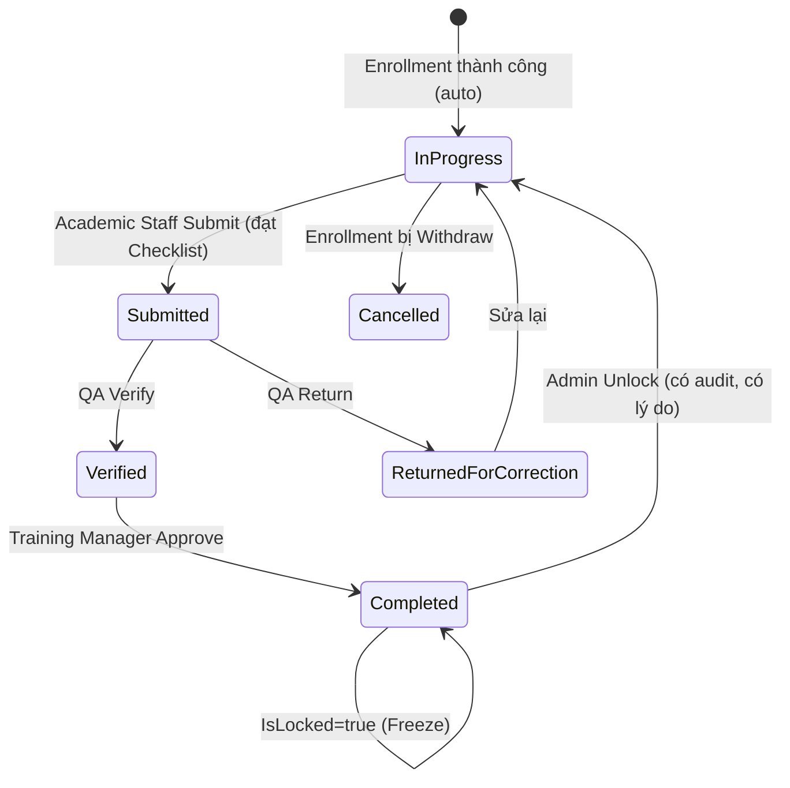

# 4. ETR Management (Quản lý Hồ sơ ETR)

## 4.1 Mục đích & Phạm vi

ETRCourseRecord là **trung tâm điều phối dữ liệu** — tập hợp mọi hoạt động đào tạo của 1 Learner cho 1 Course cụ thể (qua 1 Enrollment). Module này quản lý vòng đời trạng thái của hồ sơ này, từ khởi tạo đến khi hết hạn/cần đào tạo lại.

## 4.2 Actors & RBAC

| Actor | Quyền hạn |
|---|---|
| **System** | Auto-create ETRCourseRecord khi Enrollment thành công (không có actor con người ở bước này) |
| **Academic Staff** | Liên kết dữ liệu, theo dõi tiến độ, Submit ETR |
| **QA Staff** | Verify ETR |
| **Training Manager** | Approve/Return ETR, duyệt Unlock request |
| **Admin** | Unlock ETR đã Completed (escape hatch có kiểm soát) |

## 4.3 Entities liên quan

**ETRCourseRecord**: `ETRCourseRecordId, EnrollmentId, Status, SubmittedAt, VerifiedAt, CompletedAt, IsLocked, CreatedBySystem, IssuedDate, ExpiryDate, PreviousRecordId, SubjectResults[]`

`Status` state machine chuẩn:

```
In Progress → Submitted → Verified → Completed
                 ↑            |
                 └── Returned for Correction ──┘
                 |
              Rejected (terminal, hoặc quay lại In Progress tùy chính sách)

(bất kỳ lúc nào từ In Progress) → Cancelled  [khi Enrollment bị withdraw]
```

- `IsLocked = true` khi `Status = Completed` — dữ liệu bị freeze, không sửa được trừ khi Unlock có kiểm soát.
- `PreviousRecordId` hỗ trợ trường hợp đào tạo lại (Recurrent Training) — record mới trỏ về record cũ đã hết hạn, tạo thành chuỗi lịch sử.
- `ExpiryDate` tính từ `Course.ValidityMonths` — dùng cho cảnh báo Grace Period (xem 4.6).

## 4.4 Business Rules

1. ETRCourseRecord **chỉ được tạo bởi hệ thống**, không có API tạo tay trực tiếp — luôn xuất phát từ Enrollment thành công.
2. Không thể Submit nếu Checklist (Module 7) chưa đạt Completion Requirement.
3. Sau khi `Completed` + `IsLocked=true`: mọi sửa đổi trực tiếp lên ETRCourseRecord/SubjectResult liên quan bị chặn bởi `ImmutabilityValidator`, trừ khi đi qua luồng Unlock có kiểm soát (Admin-only, bắt buộc nêu lý do, ghi Audit đầy đủ Old/New value).
4. `ExpiryDate = IssuedDate + Course.ValidityMonths` — chỉ áp dụng cho Course có validity (VD: Safety, First Aid, Sim training). Course không có hạn (VD: đào tạo 1 lần) thì `ExpiryDate = null`.

## 4.5 Luồng nghiệp vụ



## 4.6 API tương ứng (đã có trong code)

**EtrController** (`api/etr`)
- `GET /etr/my-etr`, `GET /etr/{id}`
- `GET /etr/{id}/completion-progress` — % đáp ứng Checklist
- `POST /etr/{id}/submit` — Academic Staff
- `POST /etr/{id}/verify` — QA Staff
- `POST /etr/{id}/return` — QA trả về sửa
- `POST /etr/{id}/complete` — Training Manager approve, set IsLocked=true
- `POST /etr/{id}/reopen` — Unlock (Admin-only escape hatch)
- `DELETE /etr/{id}`
- `GET /etr/student/{studentId}/history`, `GET /etr/student/{studentId}/current-status`
- `GET /etr/expiring-students?courseId=&daysThreshold=30` — Grace Period cảnh báo

## 4.7 Edge cases / Exception flows

- **`GetExpiringStudentsAsync` chỉ đọc, chưa có action tự động**: khi ETRCourseRecord hết hạn (`ExpiryDate < now`), hệ thống hiện tại **không** tự chuyển Learner sang trạng thái "không đủ điều kiện làm nhiệm vụ" (Grounded) — đây là gap nghiệp vụ hàng không quan trọng, xem TODO doc.
- **Unlock 1 ETR record đã Completed để sửa 1 lỗi nhỏ ở 1 Subject**: hiện phải mở khóa TOÀN BỘ record (`reopen`), không mở khóa được ở cấp Subject riêng lẻ → rủi ro mở khóa quá rộng so với nhu cầu sửa. Xem Module 6 & TODO doc về Amendment cấp SubjectSignoff.
- **Recurrent Training**: `PreviousRecordId` đã có trong entity nhưng chưa có API/luồng nghiệp vụ tạo record mới nối vào record cũ khi Learner học lại — cần bổ sung.

## 4.8 Handoff sang Module tiếp theo

ETRCourseRecord ở `In Progress` → **Module 5 (Attendance)** và **Module 6 (Assessment & Evidence)** đổ dữ liệu thực tế vào → **Module 7 (Completion & Approval)** đối chiếu và duyệt.
