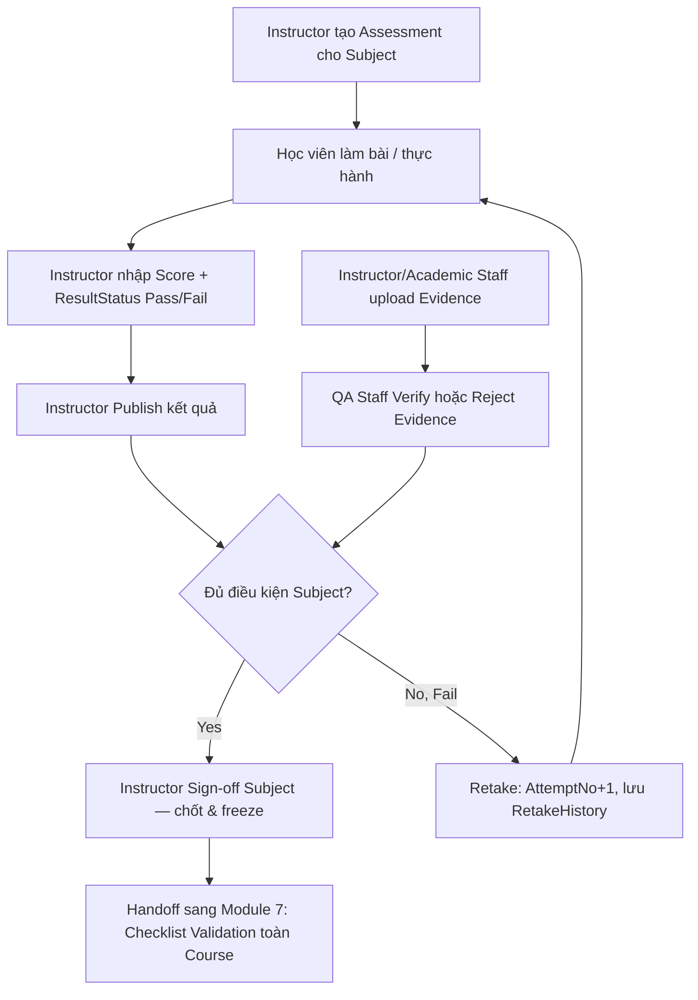

# 6. Manage Assessment & Evidence (Quản lý Đánh giá và Minh chứng Đào tạo)

## 6.1 Mục đích & Phạm vi

Chứng minh năng lực học viên qua số liệu (Assessment) và tài liệu (Evidence), có kiểm định chất lượng (QA), và chốt sổ bằng chữ ký điện tử (Sign-off) — đầu vào quan trọng nhất cho Approval Workflow (Module 7).

## 6.2 Actors & RBAC

| Actor | Quyền hạn |
|---|---|
| **Instructor** | Tạo Assessment, chấm điểm, upload Evidence, Sign-off Subject |
| **Academic Staff** | Cũng có thể upload Evidence hộ |
| **QA Staff** | Verify/Reject từng Evidence — "QA Filter" bắt buộc trước khi Evidence được tính vào Checklist |

## 6.3 Entities liên quan

- **Assessment**: `AssessmentId, CourseId, SubjectId, ComponentName, AssessmentType, Weight, PassingScore, IsRequired, DisplayOrder`
- **AssessmentResult**: `AssessmentResultId, AssessmentId, AccountId, SubjectResultId, SessionId, Score, ResultStatus (Pass/Fail), GradedByAccountId, RecordedAt, PublishedAt, IsPublished, TakenAt, Remark, AttemptNo`
- **RetakeHistory**: lưu lịch sử các lần thi lại (AttemptNo > 1)
- **EvidenceFile**: `EvidenceFileId, EvidenceTypeId, UploadedByAccountId, AccountId, SubjectResultId, AttendanceRecordId, AssessmentResultId, FileName, FilePath, FileExtension, MimeType, FileSize, VerificationStatus (Pending/Verified/Rejected), VerifiedByAccountId, VerifiedAt, VerificationComment, UploadedAt`
- **EvidenceType**: lookup phân loại minh chứng (ảnh, scan chữ ký, v.v.)
- **SubjectSignoff**: `SubjectSignoffId, SubjectResultId, SignoffByAccountId, Role, SignoffAt, Comment`
- **PracticalChecklist / PracticalChecklistResult**: checklist thực hành riêng cho Subject dạng kỹ năng (không chỉ điểm số)

## 6.4 Business Rules

1. `AssessmentResult.IsPublished = false` cho đến khi Instructor chốt điểm (`PATCH /assessmentresults/{id}/publish`) — điểm chưa publish không tính vào Checklist, tránh học viên thấy điểm nháp.
2. `AttemptNo` tăng dần khi thi lại — mỗi lần retake lưu vào `RetakeHistory`, **không ghi đè** kết quả lần trước (đây là nguyên tắc immutability, áp dụng nhất quán với Audit Trail).
3. Evidence phải qua `VerificationStatus = Verified` từ QA Staff mới được tính là hợp lệ trong Checklist — Evidence `Pending`/`Rejected` không đủ điều kiện.
4. `SubjectSignoff` là hành động **cao nhất** của Instructor cho 1 Subject — sau khi Sign-off, `SubjectResult` liên quan coi như đóng băng (không sửa Attendance/Assessment/Evidence của Subject đó nữa qua đường thông thường).
5. Sau Sign-off, nếu phát hiện sai sót: **không được sửa trực tiếp** — phải qua luồng Amendment/Unlock-request (hiện chưa có API, xem TODO doc mục ưu tiên cao).

## 6.5 Luồng nghiệp vụ

## 6.6 API tương ứng (đã có trong code)

**AssessmentsController**: `GET/POST/PUT/DELETE /assessments`, `GET /assessments/{id}`
**AssessmentResultsController**
- `GET /assessmentresults`, `POST /assessmentresults/record`
- `GET /assessmentresults/student/{classStudentId}`, `GET /assessmentresults/{id}`
- `PUT /assessmentresults/{id}`, `PATCH /assessmentresults/{id}/publish`, `DELETE /assessmentresults/{id}`

**RetakeHistoryController**: `GET /retakehistory/{id}`, `GET /retakehistory/by-subject/{subjectResultId}`

**EvidenceTypesController**: `GET/POST/PUT/DELETE /evidencetypes`
**EvidencesController**
- `GET /evidences`, `GET /evidences/{id}`, `GET /evidences/{id}/download`
- `POST /evidences/upload`
- `PUT /evidences/{id}/verify` — **chỉ verify từng cái một** (xem 6.7)
- `DELETE /evidences/{id}`

**SubjectSignoffController**: `GET/POST /subjectsignoff`, `GET /subjectsignoff/check/{subjectResultId}`

**PracticalChecklistsController / PracticalChecklistResultsController**: `GET/POST/PUT/DELETE /practicalchecklists`, `GET/PUT/PATCH /practicalchecklistresults`

## 6.7 Edge cases / Exception flows

- **Nghẽn cổ chai QA verify Evidence**: 1 lớp 30 học viên × 3 file = 90 lần gọi `PUT /evidences/{id}/verify`. Chưa có bulk-verify — UX kém, cần bổ sung `PUT /evidences/bulk-verify` (xem TODO doc, ưu tiên cao).
- **Instructor Sign-off nhầm rồi phát hiện chấm sai**: hiện KHÔNG có API unlock ở cấp `SubjectSignoff` — chỉ có unlock ở cấp toàn bộ ETRCourseRecord (Module 4), quá rộng so với nhu cầu sửa 1 Subject. Cần bổ sung Amendment Request cấp Subject (xem TODO doc, ưu tiên cao).
- **Retake không giới hạn số lần**: cần xác nhận nghiệp vụ có giới hạn `MaxAttempt` hay không — hiện `AttemptNo` chỉ tăng dần, không thấy validation chặn số lần thi lại tối đa.

## 6.8 Handoff sang Module tiếp theo

Assessment đã Publish + Evidence đã Verified + Subject đã Sign-off → dữ liệu đủ để **Module 7 — Completion Requirement & Approval Workflow** đối chiếu Checklist tổng thể của Course và chạy quy trình Submit/Verify/Approve.
