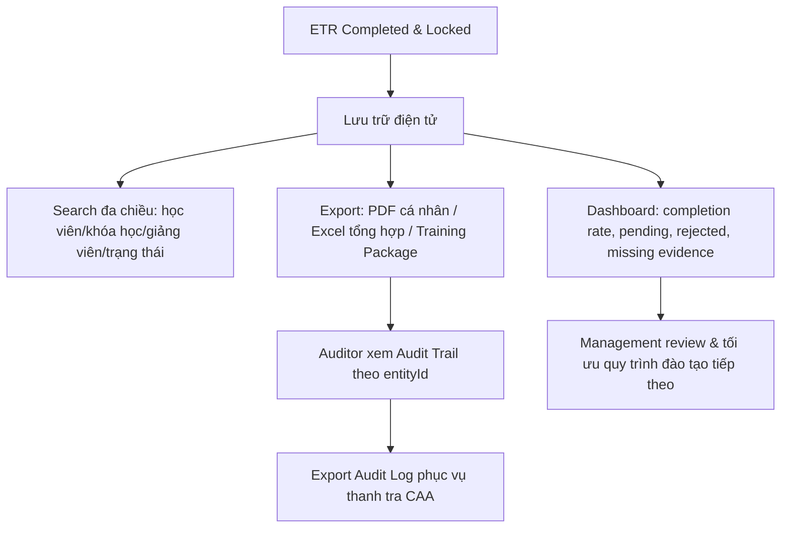

# 8. Reporting, Search & Audit Management (Báo cáo, Tra cứu & Kiểm toán)

## 8.1 Mục đích & Phạm vi

Giai đoạn cuối của vòng đời đào tạo — chuyển dữ liệu thô thành thông tin minh bạch phục vụ quản lý nội bộ và thanh tra Cục Hàng không (CAA). Đây là "vỏ bảo vệ pháp lý" cho toàn bộ dữ liệu đã tích lũy từ Module 1-7.

## 8.2 Actors & RBAC

| Actor | Quyền hạn |
|---|---|
| **Training Manager / Management Viewer** | Xem Dashboard, đôn đốc tiến độ |
| **Tất cả role nghiệp vụ** | Search đa chiều theo phạm vi quyền của mình |
| **Auditor** | Xem Audit Trail/Audit Log, export Training Package cho thanh tra — read-only tuyệt đối |

## 8.3 Entities liên quan

- **AuditLog**: `AuditLogId, AccountId, ETRRecordId, ActionType, EntityName, RecordId, OldValue, NewValue, Description, IPAddress, UserAgent` — ghi nhận **mọi** hành động sửa đổi dữ liệu nghiệp vụ quan trọng trong toàn hệ thống (không riêng ETR).
- **ExportJob**: quản lý các lần export (PDF/Excel/Training Package), có `DownloadExpiredAt` cho signed-link tải file có hạn.

## 8.4 Business Rules

1. Dashboard phải phản ánh **real-time hoặc near-real-time** trạng thái: completion rate, hồ sơ chờ duyệt/xác thực, hồ sơ bị Reject, minh chứng còn thiếu.
2. Search đa chiều (theo học viên/khóa học/giảng viên/trạng thái ETR) phải tôn trọng RBAC — Instructor chỉ search trong phạm vi lớp mình phụ trách, không search toàn hệ thống.
3. Mọi export (đặc biệt Training Package) phải có link tải có hạn (`DownloadExpiredAt`) — không để link tải vĩnh viễn công khai, tránh rò rỉ dữ liệu học viên.
4. AuditLog **bất biến** — không có API `PUT`/`DELETE` cho AuditLog (đã đúng trong code: `AuditController` chỉ có `GET`). Đây là nguyên tắc phải giữ nguyên khi refactor.
5. Training Package export phải gộp đủ: ETR PDF, báo cáo Attendance, báo cáo Assessment, và Audit History của hồ sơ đó — đủ để giải trình với CAA mà không cần tra cứu thêm nơi khác.

## 8.5 Luồng nghiệp vụ

## 8.6 API tương ứng (đã có trong code)

**DashboardController**: `GET /dashboard/stats`, `GET /dashboard/action-items`, `GET /dashboard/my-dashboard`

**SearchController**: `GET /search/classes`, `GET /search/etrs`

**ExportsController**
- `GET /exports/{id}` — trạng thái export job
- `POST /exports/training-package` — ZIP gồm PDF + Excel + Audit_History.pdf
- `POST /exports/pdf` — ETR summary PDF
- `POST /exports/dashboard` — PDF dashboard
- `POST /exports/attendance`, `POST /exports/assessment`, `POST /exports/class-summary` — Excel
- `GET /exports/download/{id}` — tải file qua signed link có hạn

**AuditController**
- `GET /audit` — danh sách (có phân trang)
- `GET /audit/{id}`
- `GET /audit/search` — theo `ActionType`/`EntityName`/`Description`

## 8.7 Edge cases / Exception flows

- **Link download hết hạn nhưng người dùng vẫn cần file** (VD: thanh tra yêu cầu lại sau vài ngày): cần luồng tái tạo export job mới, không nên gia hạn link cũ (giữ nguyên tắc "mỗi lần tải là 1 audit event mới").
- **Audit Log quá lớn theo thời gian**: cần chiến lược archive/partition dữ liệu AuditLog dài hạn (không nằm trong scope code hiện tại, nhưng cần lưu ý khi hệ thống vận hành nhiều năm).
- **Search vượt quyền**: nếu `SearchController` không filter theo Role của người gọi ở tầng service (chỉ filter ở tầng UI), Instructor có thể vô tình search thấy dữ liệu lớp khác — cần rà soát kỹ tầng service.

## 8.8 Kết thúc vòng đời

Đây là module cuối — không có handoff tiếp theo trong 1 vòng đời ETR đơn lẻ. Dữ liệu từ đây phục vụ 2 mục đích dài hạn: (1) giải trình pháp lý với CAA khi có thanh tra, (2) input cho Ban quản lý cải tiến quy trình đào tạo các khóa tiếp theo (quay lại Module 3).
