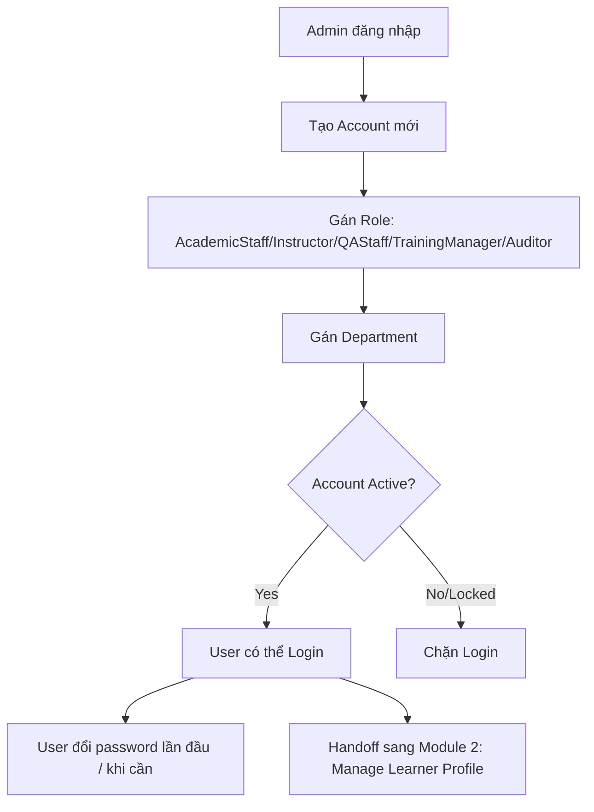

# 1. User & Access Management (Quản lý Người dùng & Phân quyền)

## 1.1 Mục đích & Phạm vi

Module nền móng của toàn hệ thống ETR — thiết lập danh tính (identity) và quyền hạn (authorization) cho mọi tác nhân trước khi bất kỳ nghiệp vụ đào tạo nào có thể vận hành. Không có tài khoản + role hợp lệ, không entity nghiệp vụ nào (Course, Class, Enrollment, ETR...) có thể được tạo/duyệt.

## 1.2 Actors & RBAC

| Actor | Vai trò trong hệ thống | Quyền hạn cốt lõi |
|---|---|---|
| **Admin** | Quản trị hệ thống | Full quyền: tạo/khóa/mở account, gán Role/Department, xem toàn bộ Audit Log, unlock ETR record (escape hatch) |
| **Academic Staff** | Giáo vụ — vận hành hành chính | Tạo Learner Profile, tạo Course/Class, Enroll/Withdraw học viên, Submit ETR |
| **Instructor** | Giảng viên — thực thi tại lớp | Read-only CompletionRequirement; ghi Attendance, chấm Assessment, upload Evidence, Sign-off Subject |
| **QA Staff** | Kiểm định chất lượng | Verify/Reject Evidence, Review & Verify ETR (bước 2 trong approval chain) |
| **Training Manager** | Quản lý đào tạo | Approve ETR cuối cùng (freeze), duyệt Amendment/Unlock-request |
| **Auditor** | Kiểm toán viên (nội bộ/CAA) | Read-only toàn hệ thống: Audit Trail, Audit Log, Training Package export |
| **Management Viewer** | Quan sát cấp quản lý | Read-only Dashboard/thống kê tổng quan, không có quyền nghiệp vụ nào khác |
| **Learner (Student)** | Đối tượng đào tạo | **Có account đăng nhập riêng** (Role `Student`) — tự xem ETR của chính mình (`GET /etr/my-etr`), hồ sơ cá nhân (`GET /userprofiles/me`) và Dashboard cá nhân (`GET /dashboard/my-dashboard`); không có quyền sửa dữ liệu nghiệp vụ |

Nguyên tắc RBAC: **1 Account — 1 Role** (RoleId trên Account). Không có multi-role trên 1 account trong scope hiện tại; nếu 1 người vừa là Instructor vừa là Academic Staff, cần 2 account riêng.

## 1.3 Entities liên quan

- **Account**: `AccountId, Username, PasswordHash, RoleId, DepartmentId, Status (Active/Locked), IsActive`
- **Role**: `RoleId, RoleName, Description` — giá trị chuẩn trong code (`DataSeeder.cs`): `Admin, Instructor, QA, Academic, TrainingManager, Student, Audit, ManagementViewer` (không phải `AcademicStaff`/`QAStaff`/`Auditor` như tên gọi nghiệp vụ ở mục 1.2 — đây là tên hiển thị, `RoleName` lưu trong DB dùng các giá trị ngắn trên).
- **Department**: lookup đơn vị/phòng ban của Account
- **UserProfile** (chi tiết ở module 2): liên kết 1-1 với Account khi Account đóng vai trò Learner

## 1.4 Business Rules

1. Username phải unique toàn hệ thống.
2. Password lưu dạng hash (bcrypt/argon2) — không lưu plaintext, không dùng MD5/SHA1.
3. **Admin và Academic** có quyền gán/đổi Role và Department cho Account (`PUT /accounts/{id}/role`, `PUT /accounts/{id}/department` — `[Authorize(Roles = "Admin,Academic")]` trong code, không phải Admin-only).
4. Account bị `Locked` (Status=Locked hoặc IsActive=false) không thể login (`POST /auth/login` phải chặn ở tầng service, không chỉ tầng UI).
5. Đổi mật khẩu (`POST /auth/change-password`) yêu cầu xác thực mật khẩu cũ.
6. Refresh token (`POST /auth/refresh-token`) phải có cơ chế expiry và revoke khi logout (`POST /auth/logout`).
7. Mọi hành động tạo/sửa/khóa Account phải ghi AuditLog (ActionType, ActorAccountId, RecordId=target AccountId).

## 1.5 Luồng nghiệp vụ

## 1.6 API tương ứng (đã có trong code)

**AccountsController** (`api/accounts`)
- `GET /accounts`, `GET /accounts/{id}` — danh sách/chi tiết account
- `POST /accounts` — tạo account mới
- `PUT /accounts/{id}/status` — khóa/mở khóa
- `PUT /accounts/{id}/role` — gán role
- `PUT /accounts/{id}/department` — gán department
- `DELETE /accounts/{id}` — xóa account

**AuthController** (`api/auth`)
- `POST /auth/login`, `POST /auth/google-login`
- `GET /auth/mock-admin-token` *(chỉ dùng cho môi trường dev/test — cần đảm bảo bị chặn ở production)*
- `POST /auth/refresh-token`, `POST /auth/logout`
- `POST /auth/change-password`, `POST /auth/forgot-password`, `POST /auth/reset-password`
- `GET /auth/me`

## 1.7 Edge cases / Exception flows

- **Khóa account đang có việc dở** (VD: Instructor đang có Session chưa confirm): hệ thống vẫn cho khóa account, nhưng dữ liệu đã ghi (Attendance/Assessment) không bị ảnh hưởng — chỉ chặn hành động mới của account đó.
- **Đổi Role giữa chừng** (VD: Instructor → Academic Staff): các bản ghi cũ (Attendance/Sign-off) vẫn giữ nguyên `RecordedByAccountId`/`SignoffByAccountId` — không hồi tố đổi tên vai trò trong lịch sử.
- **`mock-admin-token` endpoint**: PHẢI được loại bỏ hoặc chặn bằng environment guard trước khi lên production — hiện là rủi ro bảo mật nếu vô tình expose.

## 1.8 Handoff sang Module tiếp theo

Đầu ra: Account đã có Role hợp lệ (đặc biệt là Academic Staff) → sẵn sàng để tạo Learner Profile ở **Module 2 — Manage Learner Profile**.
