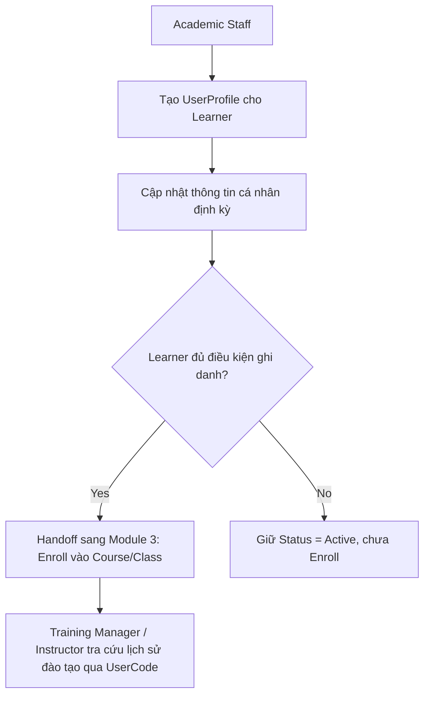

# 2. Manage Learner Profile (Quản lý Hồ sơ Học viên)

## 2.1 Mục đích & Phạm vi

Thiết lập dữ liệu nền tảng về đối tượng đào tạo (Learner) — pilot/ground staff. Đây là điều kiện tiên quyết để thực hiện Enrollment ở Module 3.

## 2.2 Actors & RBAC

| Actor | Quyền hạn |
|---|---|
| **Academic Staff** | Tạo/cập nhật UserProfile (Learner), quản lý trạng thái |
| **Training Manager** | Xem lịch sử đào tạo toàn bộ Learner (không sửa) |
| **Instructor** | Xem UserProfile của Learner thuộc lớp mình phụ trách (read-only, qua `CourseEnrollment` — bảng `ClassStudent` đã bị loại bỏ khỏi schema) |
| **Admin** | Xem/sửa UserProfile qua endpoint quản trị (`/{accountId}`) |

## 2.3 Entities liên quan

- **UserProfile**: `AccountId (FK Account), UserCode, FullName, Email, Phone, DateOfBirth, Gender, Organization, Status`
  - `Status` giá trị chuẩn: `Active, Withdrawn, Graduated, Grounded` — `Grounded` đã được bổ sung (`ETR.Application/Compliance/LearnerStatus.cs`) cho đặc thù hàng không: tự động set/clear bởi `EtrService.RefreshGroundedStatusAsync` khi học viên có chứng chỉ (`ETRCourseRecord.ExpiryDate`) đã hết hạn mà chưa có ETR mới thay thế — xem Module 4.
- Liên kết: `CourseEnrollment` (1 Learner có N Enrollment), `ETRCourseRecord` (qua Enrollment).

## 2.4 Business Rules

1. UserProfile luôn gắn 1-1 với một Account đã tồn tại (AccountId là khóa ngoại + khóa chính) — không tạo UserProfile độc lập không có Account.
2. `UserCode` phải unique — dùng để tra cứu chéo hồ sơ đào tạo (không đổi UserCode sau khi tạo).
3. Chỉ Academic Staff (hoặc Admin) có quyền tạo/sửa UserProfile; Instructor chỉ xem.
4. Đổi Status sang `Withdrawn`/`Graduated` không xóa dữ liệu lịch sử (Enrollment/ETR cũ vẫn giữ nguyên, chỉ đổi trạng thái hiện tại của Learner).

## 2.5 Luồng nghiệp vụ

## 2.6 API tương ứng (đã có trong code)

**UserProfilesController**
- `GET /userprofiles/learners` — danh sách learner
- `GET /userprofiles/me` — profile của account hiện tại
- `GET /userprofiles/{accountId}` — chi tiết
- `POST /userprofiles/{accountId}` — tạo profile cho account
- `PUT /userprofiles/me` — tự cập nhật (nếu Learner có tài khoản riêng)
- `PUT /userprofiles/{accountId}` — Academic Staff cập nhật
- `PUT /userprofiles/{accountId}/status` — đổi trạng thái

## 2.7 Edge cases / Exception flows

- **Learner nghỉ giữa khóa**: đổi Status = `Withdrawn`, đồng thời phải trigger Withdraw ở Enrollment tương ứng (Module 3) — không để 2 nguồn dữ liệu lệch nhau (UserProfile.Status = Withdrawn nhưng Enrollment.Status vẫn Active).
- **Trùng UserCode do nhập tay**: cần validate unique tại tầng API, trả lỗi rõ ràng (409 Conflict) — không chặn ở tầng UI đơn thuần.
- **Learner không có Account (chưa từng login)**: vẫn hợp lệ trong scope hiện tại vì Learner không bắt buộc tự truy cập hệ thống; UserProfile được Academic Staff quản lý hộ.

## 2.8 Handoff sang Module tiếp theo

Đầu ra: UserProfile ở trạng thái `Active` → sẵn sàng cho **Module 3 — Manage Course, Class & Enrollment**.
