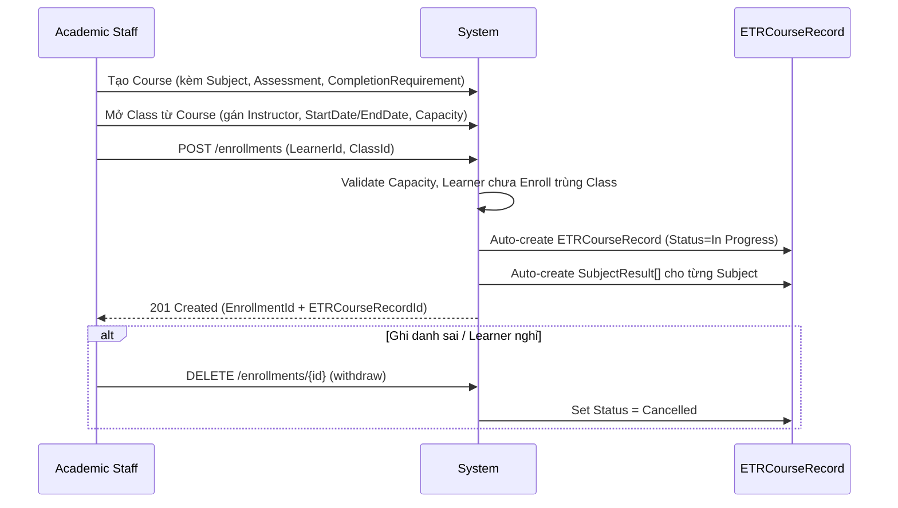

# 3. Manage Course, Class & Enrollment (Quản lý Khóa học, Lớp học & Ghi danh)

## 3.1 Mục đích & Phạm vi

Cầu nối giữa dữ liệu nền (Learner) và quá trình đào tạo thực tế. Đây là module chứa **điểm kích hoạt (trigger) quan trọng nhất của toàn hệ thống**: Enrollment thành công → tự động sinh ETRCourseRecord.

## 3.2 Actors & RBAC

| Actor | Quyền hạn |
|---|---|
| **Academic Staff** | Tạo/cập nhật Course, mở Class, gán Instructor (per-Subject via `InstructorAssignments[]`), Enroll/Withdraw Learner — **Admin cũng có đủ quyền này** (`[Authorize(Roles = "Admin,Academic")]` trên mọi action tạo/sửa/xoá của `CoursesController`/`ClassesController`/`EnrollmentsController`) |
| **Training Manager** | **Chỉ xem** (`GET`) Course/Class/Enrollment để theo dõi tiến độ — KHÔNG có quyền tạo/sửa/xoá (khác với mô tả "Academic Staff / Training Manager" ở phiên bản trước của tài liệu này; code hiện tại giới hạn quyền viết cho Admin/Academic) |
| **Instructor** | Read-only Course/Class thông tin cấu hình (không sửa "luật chơi"); cập nhật Session đã được tạo sẵn (ngày, phòng học, điểm danh) |

## 3.3 Ba thực thể cốt lõi — PHẢI phân biệt rõ

| Entity | Vai trò | Đặc điểm |
|---|---|---|
| **Course** | "Bản thiết kế gốc" — trừu tượng, chưa có người học | Gồm Subject, Assessment, CompletionRequirement. Có `ValidityMonths` (hạn hiệu lực chứng chỉ sau khi hoàn thành) |
| **Class** | "Thực thể sống" sinh ra từ 1 Course | Có `StartDate/EndDate`, `Location`, `Capacity`, `Status`. Instructor được phân công **per-Subject** qua bảng `ClassSubject` (xem addition-3.md) — Class không còn `InstructorAccountId` trực tiếp |
| **CourseEnrollment** | "Sợi dây sinh mệnh" nối Learner ↔ Class | `Status` (Active/Failed/Withdrawn/Completed), sinh ra đúng 1 `ETRCourseRecord` |

## 3.4 Business Rules

1. Course phải có ≥ 1 Subject trước khi được dùng để mở Class (đã enforce trong code: tạo Course yêu cầu tối thiểu 1 subject).
2. Class không thể có sĩ số vượt `Capacity`.
3. **Enroll thành công → hệ thống AUTO tạo `ETRCourseRecord` (Status = `In Progress`) và các `SubjectResult` con tương ứng với từng Subject của Course** — đây là business rule quan trọng nhất của toàn hệ thống, không được bỏ sót khi refactor.
4. Withdraw/Cancel Enrollment → `ETRCourseRecord` tương ứng phải chuyển `Status = Cancelled` (không xóa cứng, không để rác lơ lửng cho Auditor).
5. Sửa Course/CompletionRequirement khi đang có Class đang chạy: **đã có Versioning** (`Course.VersionNo`/`EffectiveFrom`, `CompletionRequirement.VersionNo`/`EffectiveFrom`/`EffectiveTo`) — khi `RequirementType`/`ThresholdValue`/`IsMandatory` thay đổi, dòng cũ bị đóng (`EffectiveTo` set) và 1 dòng mới được tạo với `VersionNo` tăng, thay vì ghi đè. `ETRCourseRecord.CourseVersionNo` snapshot version tại thời điểm Enroll, nên Checklist Validation luôn đối chiếu đúng luật đã áp dụng khi học viên ghi danh, không bị hồi tố khi luật đổi giữa khóa. Sửa cosmetic (`RequirementName`/`Description`/`DisplayOrder`) vẫn update tại chỗ, không tạo version mới.

## 3.5 Luồng nghiệp vụ

## 3.6 API tương ứng (đã có trong code)

**CoursesController**: `GET/POST/PUT/DELETE /courses`, `POST/GET/PUT/DELETE /courses/{id}/subjects`
**ClassesController**: `GET/POST/PUT/DELETE /classes`
**EnrollmentsController**: `GET /enrollments`, `GET /enrollments/{id}`, `GET /enrollments/student/{studentId}`, `POST /enrollments`, `PUT /enrollments/{id}`, `DELETE /enrollments/{id}` *(= withdraw, xem 3.7)*
**CompletionRequirementsController**: `GET/POST/PUT/DELETE /completionrequirements`, `GET /completionrequirements/course/{courseId}`
**SubjectsController**: `GET/POST/PUT/DELETE /subjects`

> **Đã loại bỏ:** `ClassStudentsController` không còn tồn tại trong code — bảng trung gian `ClassStudent` đã bị gỡ khỏi schema (xem `docs/todo/9.todo_to_complete_system.md`, mục #10). Tra cứu học viên theo lớp/enrollment nay dùng trực tiếp `EnrollmentsController` (`GET /enrollments/student/{studentId}`) hoặc `AttendanceRecord`/`ETRCourseRecord` trỏ thẳng vào `CourseEnrollment.EnrollmentId`.

## 3.7 Edge cases / Exception flows

- **Enroll nhầm học viên**: dùng `DELETE /enrollments/{id}` — code hiện tại xử lý đúng nghiệp vụ (soft withdraw: `CourseEnrollment.Status = "Withdrawn"` + `IsDeleted = true`, cascade `ETRCourseRecord.Status = "Cancelled"` nếu ETR còn Draft/InProgress; chặn bằng lỗi nghiệp vụ nếu ETR đã Verified/Completed/Locked), nhưng **route đặt tên `DELETE` gây hiểu lầm là xóa cứng**. Team nên đọc kỹ code trước khi gọi API này — không phải xóa dữ liệu, là withdraw có kiểm soát. (Đề xuất đổi tên route trong TODO doc.)
- **Enroll trùng** (1 Learner enroll 2 lần vào cùng 1 Class): phải chặn ở tầng service, trả lỗi rõ ràng.
- **Class đã đầy Capacity**: chặn Enroll mới, trả lỗi nghiệp vụ (không phải lỗi 500).
- **Sửa CompletionRequirement giữa khóa**: xem Business Rule #5 — rủi ro hồi tố học viên đã hoàn thành trước đó.

## 3.8 Handoff sang Module tiếp theo

Đầu ra: `ETRCourseRecord` (Status=In Progress) đã tồn tại → **Module 4 — ETR Management** theo dõi vòng đời hồ sơ này; đồng thời **Module 5 — Attendance** và **Module 6 — Assessment & Evidence** bắt đầu đổ dữ liệu thực tế vào.
