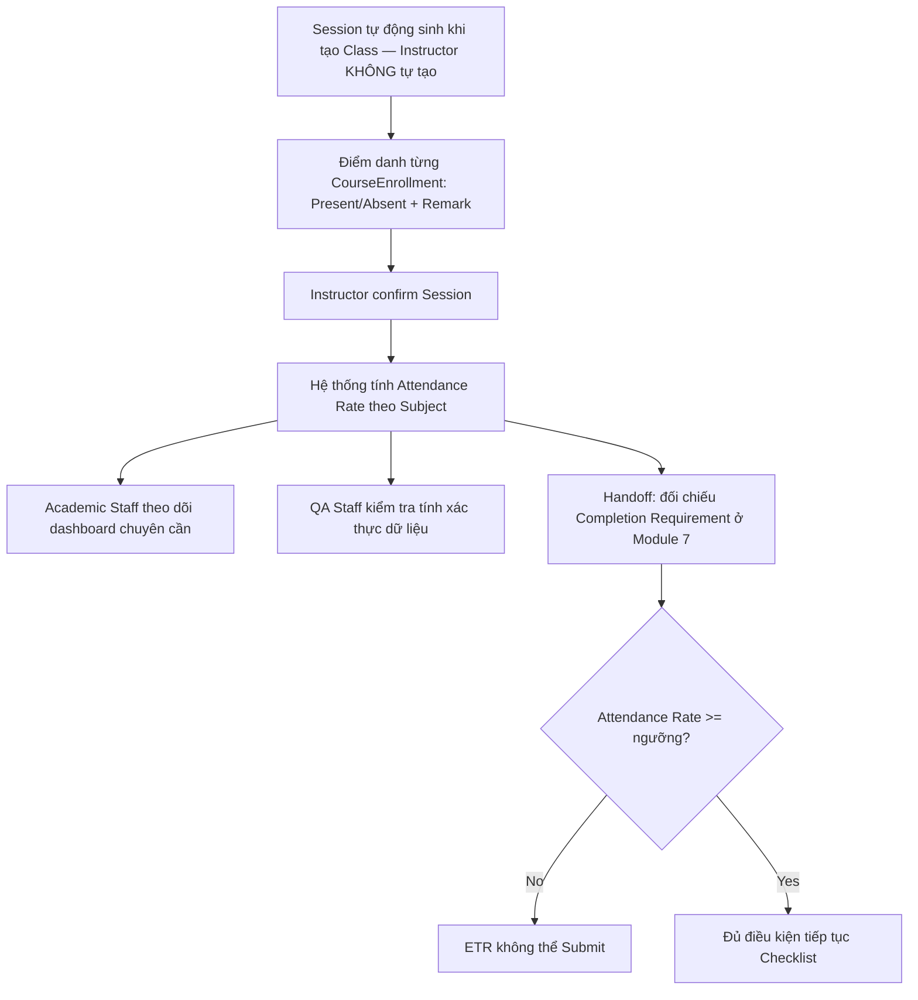

# 5. Manage Attendance (Quản lý Điểm danh)

## 5.1 Mục đích & Phạm vi

Chuyển hóa sự hiện diện của học viên tại lớp thành dữ liệu số có giá trị pháp lý — đầu vào bắt buộc cho Checklist hoàn thành khóa học (Module 7).

## 5.2 Actors & RBAC

| Actor | Quyền hạn |
|---|---|
| **Instructor** | Cập nhật Session (ngày học, phòng học) — **KHÔNG được tạo/xóa Session thủ công** (tự động sinh khi tạo Class), ghi nhận Attendance Record, confirm session |
| **Academic Staff** | Theo dõi tỷ lệ chuyên cần, nhắc nhở học viên |
| **QA Staff** | Kiểm tra tính xác thực của dữ liệu điểm danh |

## 5.3 Entities liên quan

- **Session**: `SessionId, ClassId, SubjectId, SessionTitle, SessionDate (nullable — null = chưa lên lịch/TBA), Location, IsConfirmed, ConfirmedByAccountId, ConfirmedAt, IsAssessmentRequired, IsChecklistRequired`
- **AttendanceRecord**: `AttendanceRecordId, SessionId, EnrollmentId (FK CourseEnrollment — KHÔNG còn qua bảng trung gian ClassStudent, đã bị loại bỏ khỏi schema), Status (Present/Absent — giá trị `Late` đã bị loại bỏ khỏi hệ thống), Remarks, RecordedByAccountId, RecordedAt`

## 5.4 Business Rules

1. Session phải thuộc 1 Class cụ thể và 1 Subject cụ thể (không điểm danh tự do không gắn Subject).
2. Mỗi `CourseEnrollment` trong Session chỉ có đúng 1 AttendanceRecord (không duplicate).
3. `Status = Absent` nên đi kèm `Remarks` (lý do) — khuyến nghị bắt buộc ở tầng validation khi Status ≠ Present. (Giá trị `Late` đã bị loại bỏ khỏi hệ thống — chỉ còn `Present`/`Absent`.)
4. Sau khi Instructor `confirm` Session (`POST /sessions/{sessionId}/confirm`), dữ liệu điểm danh của session đó coi như chốt — sửa lại cần lý do rõ ràng và nên ghi Audit (hiện tại: PUT vẫn khả dụng, cần rà soát có validate IsConfirmed trước khi cho sửa hay không).
5. Attendance Rate = số buổi Present (có thể tính cả Late tùy chính sách) / tổng số Session bắt buộc của Subject — dùng để đối chiếu Completion Requirement (VD: tối thiểu 80% cho ngành hàng không).

## 5.5 Luồng nghiệp vụ

## 5.6 API tương ứng (đã có trong code)

**SessionsController**: `GET /sessions`, `GET /sessions/{id}`, `PUT /sessions/{id}` — **POST và DELETE bị khóa** (service ném `NotSupportedException`; Session được tạo/xóa tự động khi Class được tạo)
**AttendanceController**
- `GET /attendance`, `GET /attendance/{id}`
- `GET /attendance/low-attendance` — danh sách học viên chuyên cần thấp
- `POST /attendance/record` — ghi điểm danh
- `POST /attendance/sessions/{sessionId}/confirm` — chốt session
- `GET /attendance/student/{classStudentId}` — lịch sử điểm danh của 1 học viên (tham số giữ tên cũ nhưng thực chất là `EnrollmentId`)
- `PUT /attendance/{id}`, `DELETE /attendance/{id}`

**ImportController** *(mới — không có trong bản trước của tài liệu này)*: `GET /import/attendance/template`, `POST /import/attendance/validate`, `POST /import/attendance/commit` — nhập điểm danh hàng loạt từ file Excel (validate trước, commit sau khi soát lỗi), giảm số lần gọi `POST /attendance/record` thủ công cho lớp đông học viên.

## 5.7 Edge cases / Exception flows

- **Sửa Attendance sau khi Session đã confirm**: cần xác nhận rõ trong code liệu `PUT /attendance/{id}` có chặn khi `Session.IsConfirmed = true` hay không — nếu không chặn, đây là lỗ hổng cho phép sửa dữ liệu "đã chốt" mà không qua Amendment flow. (Xem TODO doc.)
- **Học viên vắng có lý do chính đáng (nghỉ bệnh có giấy tờ)**: hiện chỉ có `Remarks` dạng text tự do, không có Evidence đính kèm hoặc cờ "excused absence" tách biệt khỏi Attendance Rate — cần xác nhận với nghiệp vụ thật xem có cần tách biệt hay không.
- **Session không bắt buộc điểm danh** (VD: buổi ôn tập tự do): dùng cờ `IsAssessmentRequired`/`IsChecklistRequired = false` để loại khỏi phép tính Attendance Rate bắt buộc.

## 5.8 Handoff sang Module tiếp theo

AttendanceRecord đã confirm → tự động tính vào Attendance Rate của ETRCourseRecord → dùng làm input đối chiếu ở **Module 7 — Completion Requirement & Approval**, song song với **Module 6 — Assessment & Evidence**.
