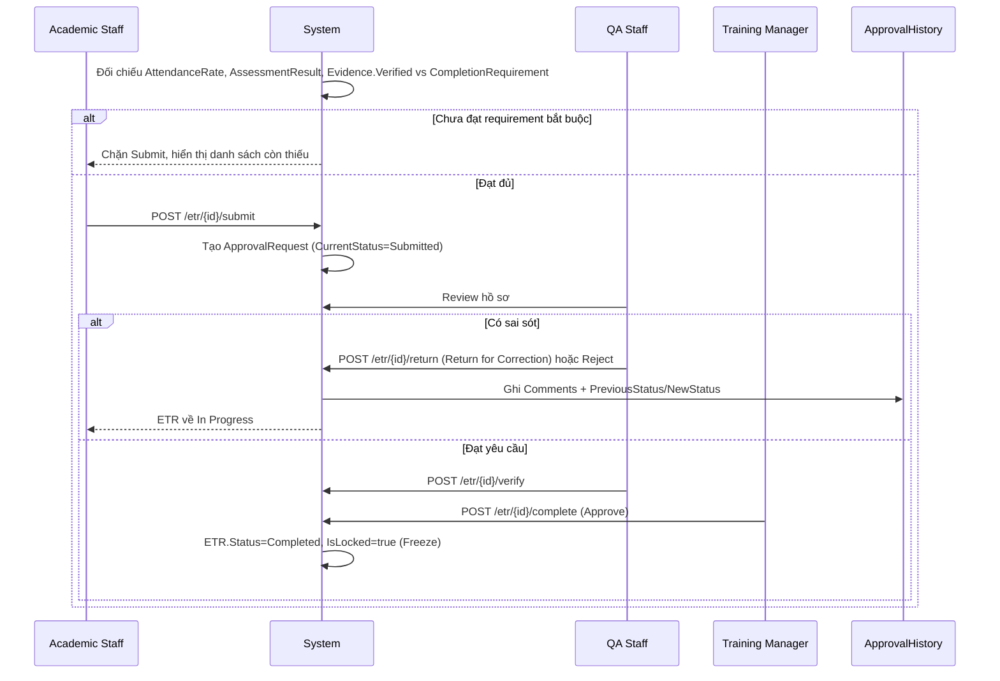

# 7. Completion Requirement & ETR Approval Workflow (Điều kiện Hoàn thành & Quy trình Phê duyệt)

## 7.1 Mục đích & Phạm vi

"Chốt chặn" cuối cùng đảm bảo chất lượng, tuân thủ và tính pháp lý của hồ sơ trước khi lưu trữ vĩnh viễn — đối chiếu toàn bộ dữ liệu từ Module 5 (Attendance) và Module 6 (Assessment & Evidence) với luật đã thiết lập ở Module 3 (CompletionRequirement), sau đó vận hành phê duyệt đa lớp.

## 7.2 Actors & RBAC

| Actor | Quyền hạn |
|---|---|
| **Academic Staff / Instructor** | Kiểm tra tổng thể, Submit ETR (`POST /etr/{id}/submit` cho phép cả Instructor và Academic) |
| **QA Staff** | Review & Verify, hoặc Return for Correction / Reject |
| **Training Manager** | Approve ETR cuối cùng — chuyển Completed, thực hiện Freeze |

## 7.3 Entities liên quan

- **CompletionRequirement**: `RequirementId, CourseId, RequirementName, Description, IsMandatory, DisplayOrder, RequirementType, ThresholdValue` — VD: `RequirementType=AttendanceRate, ThresholdValue=80`
- **ApprovalRequest**: `ApprovalRequestId, ETRCourseRecordId, CurrentStatus, SubmittedByAccountId, SubmittedAt, CurrentApproverId, CompletedAt`
- **ApprovalHistory**: `ApprovalHistoryId, ApprovalRequestId, ActionByAccountId, ActionType, PreviousStatus, NewStatus, Comments, ActionAt`

## 7.4 Business Rules

1. Checklist Validation đối chiếu 3 nguồn dữ liệu: `AttendanceRecord` (tỷ lệ chuyên cần), `AssessmentResult` (Pass/Fail đã Publish), `EvidenceFile.VerificationStatus=Verified` — với từng `CompletionRequirement` của Course.
2. **Không cho Submit ETR nếu bất kỳ CompletionRequirement `IsMandatory=true` chưa đạt** — đây là business rule cứng, ví dụ tỷ lệ chuyên cần ngành hàng không thường yêu cầu tối thiểu 80%.
3. Approval Workflow là tuyến tính, không cho nhảy cóc: `Submit (Academic Staff) → Verify (QA) → Approve (Training Manager)`. Không có vai trò nào được Approve trực tiếp mà bỏ qua Verify.
4. `Return for Correction`/`Reject` từ QA đưa hồ sơ về `In Progress` — Academic Staff/Instructor sửa lại rồi Submit lại; toàn bộ lượt Return/Reject phải lưu vào `ApprovalHistory` với `Comments` giải trình lý do.
5. `Approve` là hành động của Training Manager, không thể hoàn tác qua đường thông thường — chỉ có thể Unlock có kiểm soát (Module 4).

## 7.5 Luồng nghiệp vụ

## 7.6 API tương ứng (đã có trong code)

**EtrController** (chi tiết đầy đủ ở Module 4): `GET /etr/{id}/completion-progress`, `POST /etr/{id}/submit`, `POST /etr/{id}/verify`, `POST /etr/{id}/return`, `POST /etr/{id}/complete`

**ApprovalsController**
- `GET /approvals` — danh sách approval request
- `POST /approvals` — tạo request
- `POST /approvals/{id}/process?action=` — xử lý hành động, `action` là **enum thật `ApprovalActionType`** (`Verify | Approve | Reject | Return`, `ETR.Application/DTOs/Approval/ApprovalActionType.cs`) — ASP.NET Core model binding tự trả `400` cho giá trị ngoài 4 giá trị này trước khi vào service, không còn là free-string cần team tự thống nhất
- `PUT /approvals/{id}`, `DELETE /approvals/{id}`

**CompletionRequirementsController**: `GET/POST/PUT/DELETE /completionrequirements`, `GET /completionrequirements/course/{courseId}`

## 7.7 Edge cases / Exception flows

- **Sửa CompletionRequirement giữa khóa đang chạy**: đã được giải quyết bằng Versioning (`CompletionRequirement.VersionNo`/`EffectiveFrom`/`EffectiveTo`, snapshot qua `ETRCourseRecord.CourseVersionNo` tại thời điểm Enroll) — học viên đã ghi danh trước khi luật đổi vẫn được đối chiếu theo luật cũ, không bị hồi tố oan. Xem Module 3, Business Rule #5.
- **`ApprovalsController.process` dùng 1 endpoint chung cho nhiều action**: đã enforce permission theo action ở tầng service — `ApprovalService.AllowedRolesByAction` (dictionary `ApprovalActionType → string[]`) chặn cứng: chỉ `QA`/`Admin` được Verify/Reject/Return, chỉ `TrainingManager`/`Admin` được Approve — không chỉ dựa vào Role chung ở `[Authorize]` của controller.
- **Reject vs Return for Correction**: đã phân biệt rõ trong code — cả 2 đều đưa `ETRCourseRecord.Status` về `ReturnedForCorrection` nếu đang `Submitted` (không có state "Rejected" riêng ở `ETRCourseRecord`, chỉ `ApprovalRequest.CurrentStatus` phân biệt `Rejected` vs `ReturnedForCorrection`) — về mặt luồng nghiệp vụ, cả 2 đều dẫn Learner quay lại sửa & Submit lại, không phải Reject là terminal.

## 7.8 Handoff sang Module tiếp theo

ETR `Completed` + `IsLocked=true` → sẵn sàng cho **Module 8 — Reporting, Search & Audit**: lưu trữ, tra cứu, export Training Package, phục vụ thanh tra CAA.
